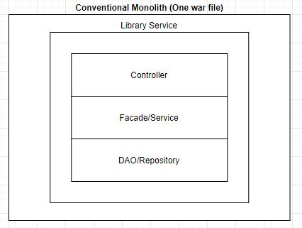
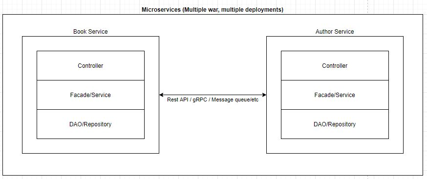
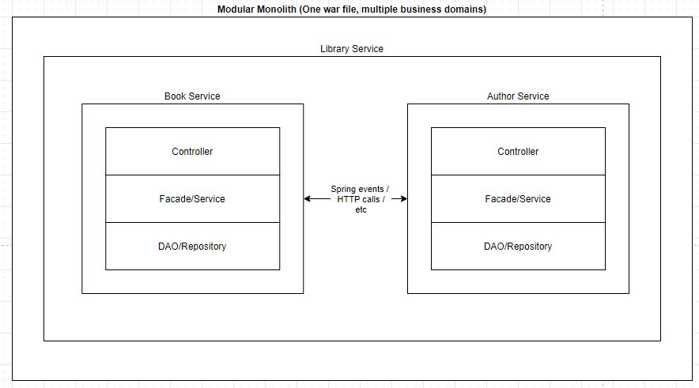

## Basic Modular Monolith demo

This repository demonstrates a very basic example of how to organize your
repository in
a [modular monolith](https://www.jrebel.com/blog/what-is-a-modular-monolith)
pattern. The main discerning characteristic of how this pattern differs from a
conventional monolith and microservice can be illustrated in the diagrams below:

*image 1: Conventional monolith includes all business domains into a single war
file*

*image 2: In microservice architecture, business domains are developed and
deployed as separate war/applications*

*image 3: Modular monolith architecture merges the two. It removes the usual
complexity that comes with microservices (tracing/monitoring/debugging) in
exchange for lower scalability (as application tends to be more memory intensive
and starts up slower). The domain boundaries are still respected in the form of
modules, which doesn't allow direct method invocation*

## Considerations

**Should I use Spring Event or normal HTTP calls when communicating between
modules?**

Design an abstraction layer that would closely mimic the communication type (
http/rpc/messaging) that you expect to use when splitting the modules into
individual microservices.

---

**Given that Book Module and Author Module lives in the same application, why
use HTTP call between them?**

The communication method (http/rpc/queue/spring-events) is not as important as
its abstraction. E.g., if you expect the communication between `author`
and `book` modules to be synchronous and request/response based, you can simply
invoke method of `book` module method directly for now. Change it to `http` when
it is time to move to separate services

---

**Why not use a multi-module maven project?**

That is significantly cleaner from a dependency management perspective. I would
encourage that instead.

---

**How to manage dependency between modules**

This particular setup requires a more manual approach to ensure that there's no
unintended dependency between modules. I would recommend using `multimodule maven`
approach along with `Java 9 jigsaw` to enforce modularity instead.

---

## TODO
1. Turn modules into multi module maven project
1. Add `module-info` to fine tune dependency
